<div id="top" align ="center">

</div>

<div align="center">

[![Contributors][contributors-shield]][contributors-url]
[![Forks][forks-shield]][forks-url]
[![Stargazers][stars-shield]][stars-url]
[![Issues][issues-shield]][issues-url]
[![Actions][actions-shield]][actions-url]

</div>

<!-- PROJECT LOGO -->
<br />
<div align="center">
  <a href="https://github.com/Nhathuy1305/Mobile-Telehealth-System.git">
    
</a>

<h3 align="center">MOBILE APPLICATION DEVELOPMENT</h3>
<h4 align="center">Team Name: ENH UONG FAMILY</h4>

  <p align="center">
    An Android application created with Kotlin, Gradle, Firebase for Mobile Application Development course in HCMIU
    <br />
    <br />
    <!-- <a href="https://youtu.be/iLo5E-07aY0">View Demo</a> -->
  </p>
</div>

<!-- TABLE OF CONTENTS -->

# Table of contents :round_pushpin:

1. [Introduction](#Introduction)
2. [Techniques](#Techniques)
3. [Charts](#Charts)
4. [Features](#Features)
5. [Challenges](#Challenges)
6. [Acknowledgments](#Acknowledgments)
7. [References](#References)

## Introduction <a name="Introduction"></a> :bricks:

<div align="center">

</div>

<div style="text-align:justify">
Technology integration is becoming more and more important in the quickly changing healthcare sector, particularly in telehealth services. The emergence of mobile health applications like Mobiheal represents a paradigm change toward more easily accessible, effective, and patient-focused healthcare. Mobiheal is supported by Firebase and is written with Kotlin in Android Studio. Appointment scheduling, appointment sorting algorithms, digital prescription management, health data visualization, rapid UPI payment integration, and dynamic patient queue management are just a few of the features it has. These elements are intended to improve patient and physician experiences with healthcare delivery and expedite telemedicine services.

</div>
</br>

### Team Members :couplekiss_man_man:

| Order |         Name          |     ID      |            Email            |                 Github                  |
|:-----:|:---------------------:|:-----------:|:---------------------------:|:-----------------------------------------------:|
|   1   | Dang Nhat Huy | ITITIU20043 | dangnhathuy.work@gmail.com | [Nhathuy1305](https://github.com/Nhathuy1305) |                                                                                  |
|   2   |     Tran Ton Dai Nghia     | ITITIU20148 |    peter.ton1214@gmail.com     |      [TRANTONDAINGHIA](https://github.com/TRANTONDAINGHIA)      |
|   3   |   Nguyen Huynh Nguyen   | ITITIU20261 |     daudaua3782@gmail.com     |   [PlayerNguyen](https://github.com/PlayerNguyen)   |                                                                            |
|   4   |  Mai Dang Huy  | ITITIU20046 |     mdhuy17@gmail.com     |    [mdhuy17](https://github.com/mdhuy17)    |                                                                  
|   5   |     Huynh Tan Thien     | ITITIU20020 |    thienhtt20@gmail.com     |  [thien20](https://github.com/thien20)  |                                            |
|   5   |     Bui Thi Cam Van     | ITITIU20111 |    buivancam02@gmail.com     |  [BUITHICAMVAN](https://github.com/BUITHICAMVAN)  |                                                                                       |

### Installation :dart:

1. Open the terminal on your IDE
2. Clone the repo
   ```sh
   git clone https://github.com/Nhathuy1305/Mobile-Telehealth-System.git
   ```
3. Check the file status
   ```sh
   git status
   ```
4. Connect to Firebase Account
   - 1 [How to Disconnect Firebase Project?](https://stackoverflow.com/questions/38120862/remove-firebase-analytics-from-android-app-completely)
   - 2 [How to Disconnect Firebase Project?](https://stackoverflow.com/questions/51549554/how-to-completely-disconnect-an-android-app-from-firebase-in-android-studio)

5. After removing the account, link to your own firebase project to test and use.
    - Follow the above steps to create account and proceed

### Motivation :mechanical_arm:

<div style="text-align:justify">

The creation and implementation of the Mobiheal application are included in the project's scope, with a particular emphasis on:

- Simplifying Appointment Scheduling: Making it simple for patients to locate and make medical provider appointments.
- Optimizing Appointment Sorting: Putting in place an algorithm to rank appointments according to health-related criteria, guaranteeing that urgent situations are attended to promptly.
- Digital Prescription Management: Providing safe digital prescription posting and retrieval for convenience and better healthcare delivery.
- Health Statistics Management: The visualization of health statistics can help individuals manage their health by giving them the means to enter and track their health data.
- Seamless Payment Integration: Integrating a UPI payment system for simple and rapid transactions is known as seamless payment integration.
- Effective Queue Management: Using a dynamic patient queue system can improve scheduling efficiency for physicians and patients alike. This is an example of effective queue management.

The principal aims of this initiative are to optimize telemedicine service efficiency, augment patient and provider satisfaction, and guarantee system scalability and security.


</div>

### Task Allocation :ok_man:

| Order | Role                                                              |  Name  |
|:------|:------------------------------------------------------------------|:----------:|
| 1     | Project Owner                     | Nhat Huy  |
| 2     | Project Manager   |   Dai Nghia |
| 3     | Front-end Developer                  | Huynh Nguyen |
| 4     | Software Engineer |   Dang Huy   |
| 5     | Back-end Developer  |  Tan Thien |
| 6     | Front-end Developer                   |  Cam Van |

<br />

## Techniques <a name="Techniques"></a>:joystick:

- <b>[Kotlin](https://kotlinlang.org/docs/android-overview.html)</b> - We developed this project using kotlin in backend & XML to implement designs into code.
The app was developed in [Android Studio](https://developer.android.com/studio). We have also used some open source libraries like [ZXing for QR Code](https://github.com/zxing/zxing), [Chart](https://github.com/majorkik/SparkLineLayout) and some [UI libraries](https://material.io/).
- <b>[Java](https://developer.android.com/guide)</b> - As Java and Kotlin are interoperable, we used a Java class that encrypts the user data while saving in the app storage using <b>AES Encryption</b>. This way we prevent anydata leak.
- <b>[Firebase](https://firebase.google.com/docs/android/setup)</b> - Firebase is a free tool for developers so we used it to authenticate users using their email and perform similar operations. We also used firebase to store user data as well as their appointment details, and etc.
Not only that, we also used firebase to store docs that are uploaded by the  users (Prescriptions).
- <b>[Figma](https://www.figma.com/)</b> - We used Figma to design the UI / UX during the designing & prototyping phase of our project.
The design we used is minimal as well as clean. People with colorbindness will have no issues using it.
- <b>[Coroutines](https://kotlinlang.org/docs/coroutines-overview.html)</b> - For asynchronous calls and tasks to utilize threads.
- <b>[Android Architecture Components](https://developer.android.com/topic/architecture)</b> - Collection of libraries that help you design testable, and maintainable apps.
  - <b>[ViewModel](https://developer.android.com/topic/libraries/architecture/viewmodel)</b> - Stores UI-related data that isn't destroyed on UI changes.
  - <b>[ViewBinding](https://developer.android.com/topic/libraries/view-binding)</b> - Generates a binding class for each XML layout file present in that module and allows you to more easily write code that interacts with views.
  - <b>[LiveData](https://developer.android.com/topic/libraries/architecture/livedata)</b> - LiveData was used to save and store values for viewModel calls and response of method calls.
  - <b>[Navigation Components](https://developer.android.com/guide/navigation/get-started)</b> - Navigation Component was used to navigate between fragments and pass parcelable objects
- <b>[Material Components for Android](https://github.com/material-components/material-components-android)</b> - Material Components for Android (MDC-Android) help developers execute Material Design. Developed by a core team of engineers and UX designers at Google, these components enable a reliable development workflow to build beautiful and functional Android apps.
- <b>[ZXing - QR Code Generator](https://github.com/zxing/zxing)</b> - ZXing's QR Code generator library to generate QR Code from Strings.

<br />


<!-- FEATURES -->

## Features <a name="Features"></a>:joystick:
### 1. Use Case Diagram
#### a. Patient User Goal Use Cases
<div align="center">
    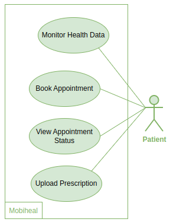
</div>

#### b. Doctor User Goal Use Cases
<div align="center">
    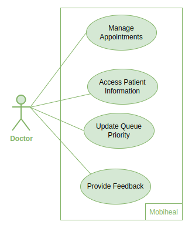
</div>
<br />
  
### 2. Database Design
#### a. Overall Design
<div align="center">
    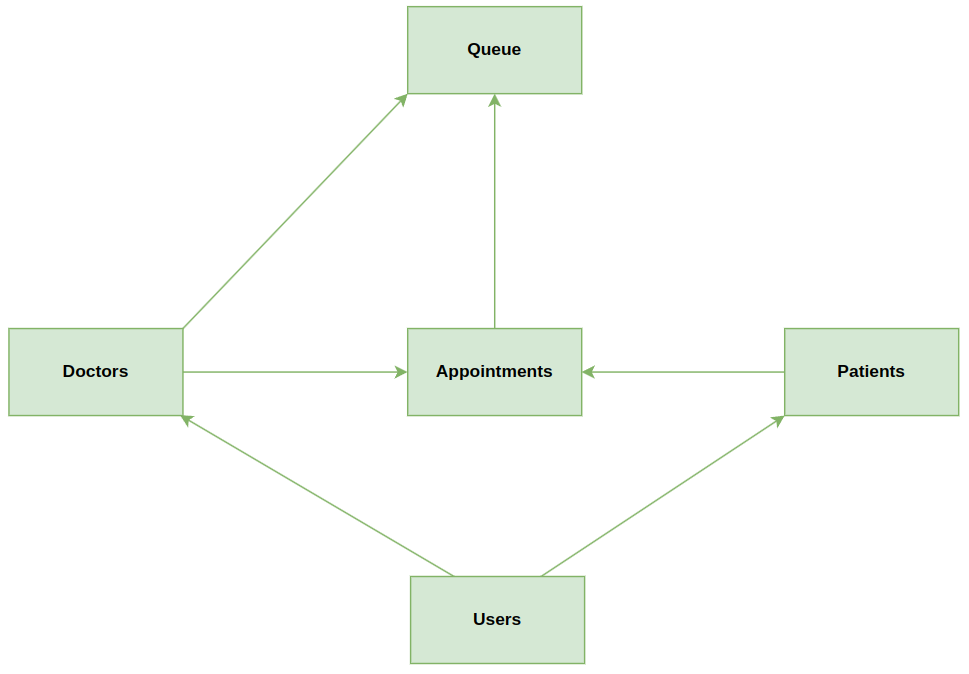
</div>

#### b. Users Design
<div align="center">
    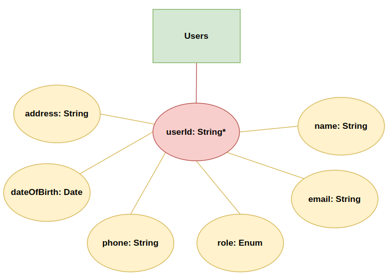
</div>
<br />

#### c. Patients Design
<div align="center">
    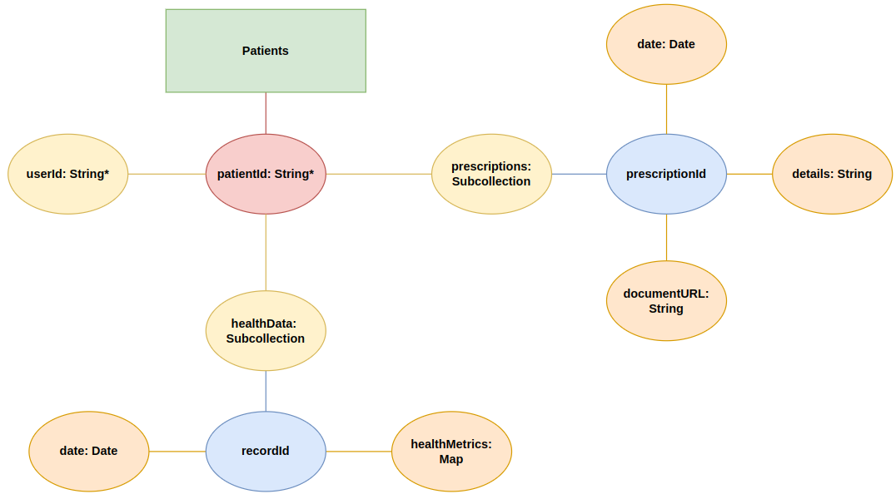
</div>
<br />

#### d. Doctors Design
<div align="center">
    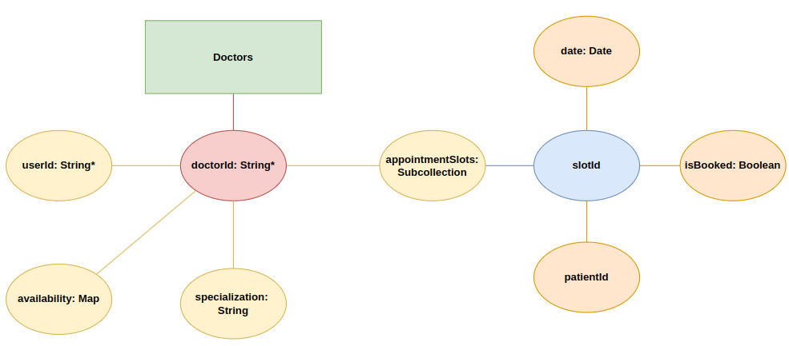
</div>
<br />

#### e. Appointments Design
<div align="center">
    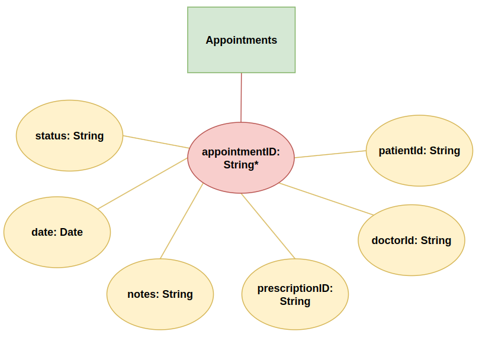
</div>
<br />

#### f. Queue Design
<div align="center">
    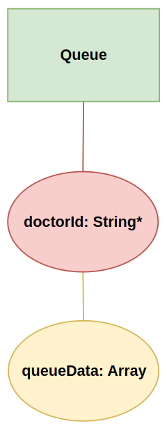
</div>
<br />

### 3. Application Architecture
<div align="center">
    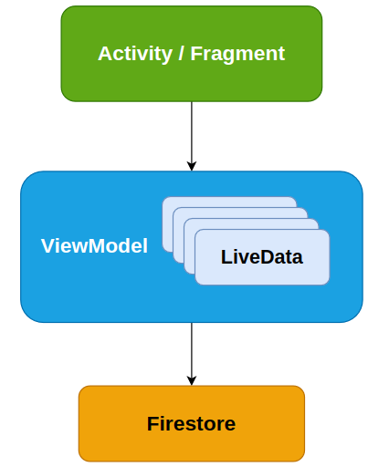
</div>
<br />

### 4. Application Flow
<div align="center">
    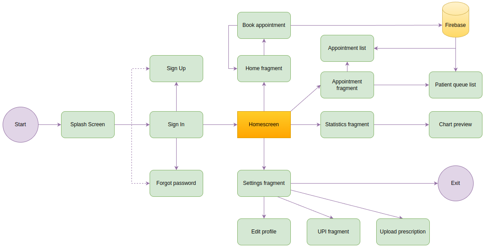
</div>
<br />

### 5. Main UI
<div align="center">
    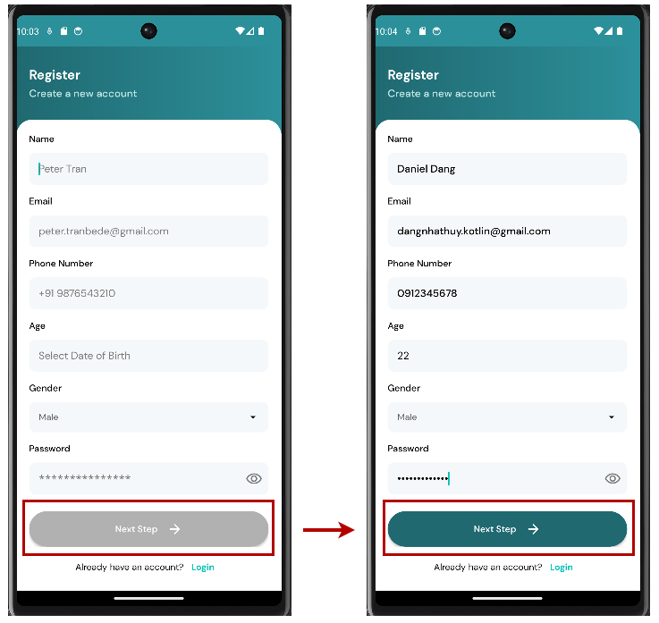
</div>
<br />

<!-- CHALLENGES -->

## Future Challenges<a name="Fulture-Challenges">:bangbang:

<div style="text-align:justify">

- Data Encryption: Ensure that sensitive data, such as user credentials, is encrypted both during transmission and storage. Implementing secure encryption protocols, like TLS for communication and strong encryption algorithms for storage, helps prevent unauthorized access.

- Authentication and Authorization: Review and reinforce the application's authentication mechanisms. Enhance user authentication processes with secure practices like multi-factor authentication. Additionally, carefully manage user permissions and implement robust authorization mechanisms to control access to different parts of the application.

- Secure Data Storage: If the enhancements involve changes to data storage, consider secure storage practices. Avoid storing sensitive information in plain text, and utilize secure storage options provided by the Android platform, such as the Keystore system.

- Input Validation: Strengthen input validation mechanisms to prevent common security vulnerabilities like SQL injection, cross-site scripting (XSS), and other injection attacks. Ensure that user inputs are validated and sanitized before being processed.

</div>

<br />

## Acknowledgments<a name="Acknowledgments">:brain:

<div style="text-align:justify">

We would like to express our heartfelt thanks to Dr. Le Duy Tan for allowing us to participate in this project and enabling us to translate our theoretical knowledge into practical applications. Although challenging, this project has proven to be extremely rewarding :heart:

</div>

<br />

## References<a name="References">  :eye::tongue::eye:

- “10 Common Challenges of Android App Development.” Fullestop Blogs, 5 Jan. 2024, www.fullestop.com/blog/what-are-10-common-challenges-most-android-developers-encounter#Conclusion. 
- Agency, DECODE. “8 Biggest Challenges of Android App Development.” DECODE, 4 Sept. 2023, decode.agency/article/android-app-development-challenges/. 
- Guest. “The Feasibility of Mobile Telehealth Solutions: Healthcare It Today.” Healthcare IT Today | Fresh, Daily, Practical Healthcare IT Insights, 18 Jan. 2021, www.healthcareittoday.com/2020/10/07/the-feasibility-of-mobile-telehealth-solutions/. 
- Hospital, Tâm Anh. “Tâm Anh Hospital.” Bệnh Viện Đa Khoa Tâm Anh | Tâm Anh Hostpial, 6 Jan. 2024, tamanhhospital.vn/. 
- Salah, D, Paige, RF & Cairns, PA 2014, A systematic literature review for agile development processes and user centred design integration. in 18th International Conference on Evaluation and Assessment in Software Engineering, EASE '14, London, England, United Kingdom, May 13-14, 2014. pp. 1-10. https://doi.org/10.1145/2601248.2601276
- TIGCAL, JOMAR. Simplifying Android Development with Coroutines and Flows: Learn to Use Kotlin Coroutines and... the Flow API to Handle Data Streams Asynchronously. PACKT PUBLISHING LIMITED, 2022. 
Varaksina, Svitlana. “Mind Studios.” Blog - Mind Studios, Mind Studios, 26 Oct. 2023, themindstudios.com/blog/telemedicine-development/. 
- Varma. “ContinuousCare.” Continuouscare, www.continuouscare.io/. Accessed 6 Jan. 2024. 

<br />

<p align="right"><a href="#top">Back to top ↑</a></p>

<!-- MARKDOWN LINKS & IMAGES -->
<!-- https://www.markdownguide.org/basic-syntax/#reference-style-links -->

[contributors-shield]: https://img.shields.io/github/contributors/Nhathuy1305/Mobile-Telehealth-System.svg?style=for-the-badge

[contributors-url]: https://github.com/Nhathuy1305/Mobile-Telehealth-System/graphs/contributors

[forks-shield]: https://img.shields.io/github/forks/Nhathuy1305/Mobile-Telehealth-System.svg?style=for-the-badge

[forks-url]: https://github.com/Nhathuy1305/Mobile-Telehealth-System/network/members

[stars-shield]: https://img.shields.io/github/stars/Nhathuy1305/Mobile-Telehealth-System.svg?style=for-the-badge

[stars-url]: https://github.com/Nhathuy1305/Mobile-Telehealth-System/stargazers

[issues-shield]: https://img.shields.io/github/issues/Nhathuy1305/Mobile-Telehealth-System.svg?style=for-the-badge

[issues-url]: https://github.com//Nhathuy1305/Mobile-Telehealth-System/issues

[actions-shield]: https://img.shields.io/github/actions/workflow/status/Nhathuy1305/Mobile-Telehealth-System/android.yml.svg?style=for-the-badge

[actions-url]: https://github.com/Nhathuy1305/Mobile-Telehealth-System/actions/workflows/android.yml